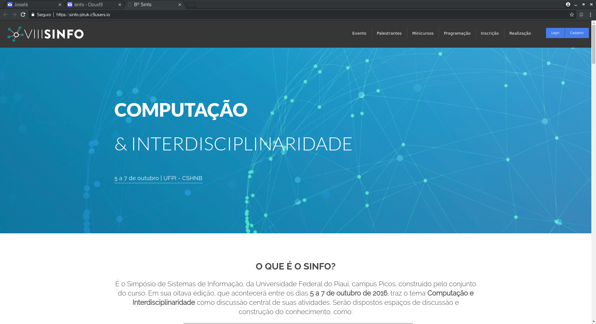
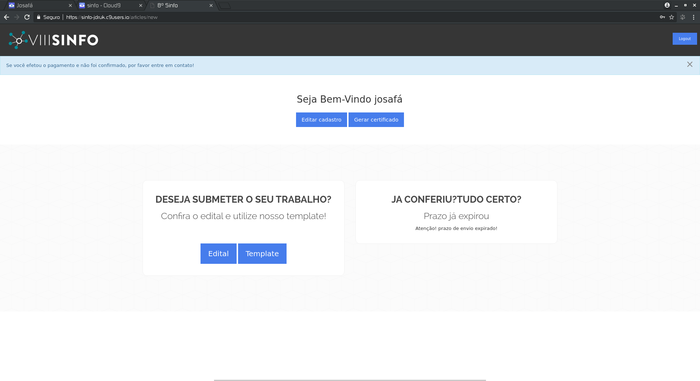
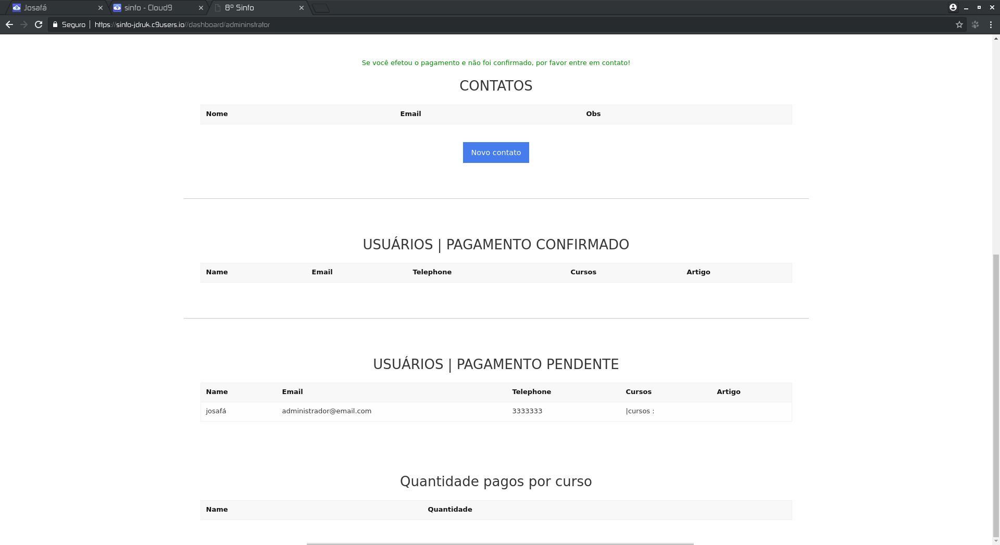

## Sinfo 2016 - edição 8
Website para o 8º evento de sistemas de informação da UFPI.

Sistema desenvolvido em ruby on rails e com integração ao [PagSeguro](https://github.com/pagseguro/ruby)

### Home

### Tela usuário comum

### Tela administrativa

